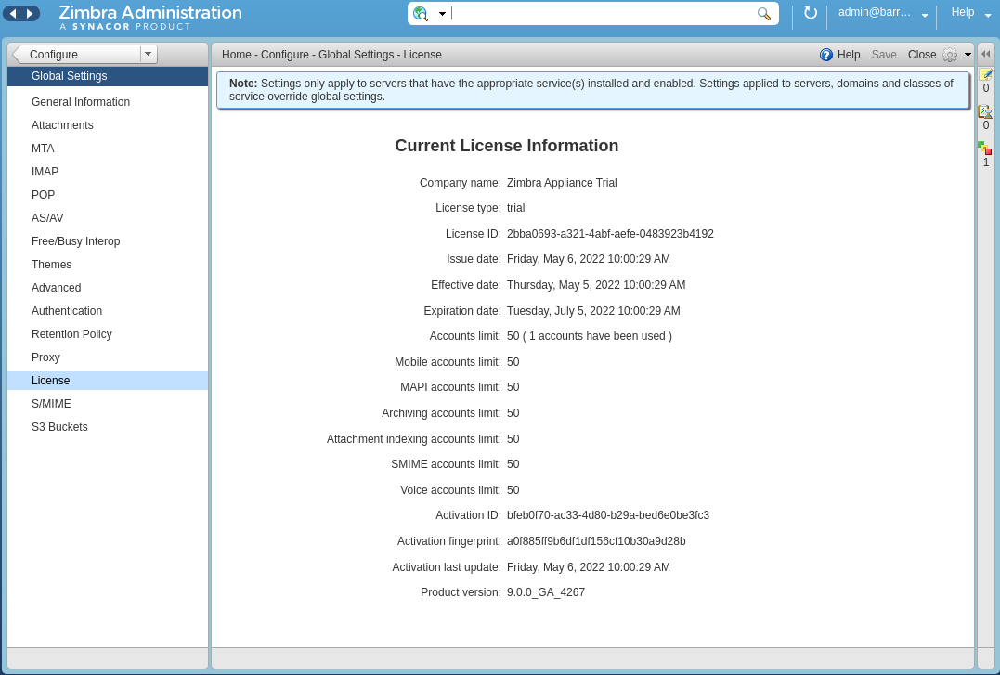
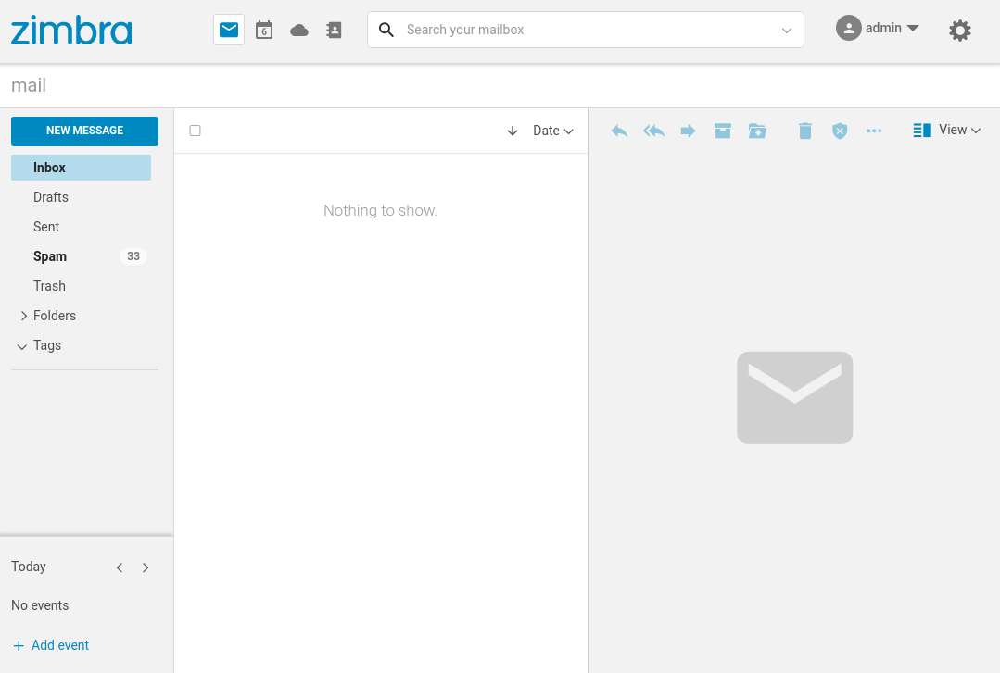

# Zimbra automated installer

## Automated installation of Zimbra and Lets Encrypt

This article introduces the `zinstaller` script that can be used for automating the installation of Zimbra. The `zinstaller` script will install a Zimbra 10 single server on Ubuntu 20 and will also obtain and install a 60-day trial license.

If you are new to Zimbra, the `zinstaller` script makes it easy to evaluate Zimbra on premise. If you already run Zimbra you can use `zinstaller` to preview the latest features. Developers can use `zinstaller` as an easy way to set-up a development server.

### Running the old zinstaller script

If your mail server is reachable under mail.example.com and you want your email addresses to look like info@example.com, you can run `zinstaller` as follows:

```
wget https://raw.githubusercontent.com/Zimbra/zinstaller/master/zinstaller -O /root/zinstaller
chmod +x /root/zinstaller
/root/zinstaller -p put-a-password-here -n mail -t 'Europe/London' -a n --letsencrypt y example.com

```

## Running the new automated install script

- The `supported-os-installer.sh` is new install script to support installs with new license server and all supported OS versions.
- New script is an attempt to create a new unified auto install script which can be used across test/dev platforms.
- Its a wrapper script around manual install process of installing Zimbra. (`supported-os-installer.sh`)
- This script should support installing all version of zimbra for all zimbra supported OS versions. 
- Tested on ubuntu20, ubuntu18, rhel7, rhel8 OS versions.
- This script should also support installation of new 10.1.0 version which requires license key instead of license.xml.

**Run as follows**
- Currently, this script can be used to install zimbra on a SINGLE NODE ONLY.
- License xml or License key is required argument depending on which ZCS version you are trying to install.
- You can provide both License key or License xml file path with `--license` option
- Download follwing files for the script to work -
```
wget https://raw.githubusercontent.com/Zimbra/zinstaller/master/supported-os-installer.sh
wget https://raw.githubusercontent.com/Zimbra/zinstaller/master/zim-install-config
```
- The file `zim-install-config` should serve as a default install config file. You can also modify it according to your own needs. But make sure not to replace any string that start with `placeholder_xxxx`.
- Run following for help -
```
supported-os-installer.sh --help
```
- For 10.0.0 / 9.0.0 / 8.8.15 versions - 
```
supported-os-installer.sh -l /path/to/license.xml --optional-pkg <pkg1> --optional-pkg <pkg2>
```
- For versions 10.1x.xx
```
supported-os-installer.sh -l <license-key> --optional-pkg <pkg1> --optional-pkg <pkg2>
```
- If the ZCS binary tgz file path is not provided the by-default the script will download the `10.0.0_GA` build based on the currrent operating system.
- The new automated install script does not have letsencrypt support yet.


**Having a poor connection over SSH? Try using `screen`:**

```
apt -y install screen
screen
wget https://raw.githubusercontent.com/Zimbra/zinstaller/master/zinstaller -O /root/zinstaller
chmod +x /root/zinstaller
/root/zinstaller -p put-a-password-here -n mail -t 'Europe/London' -a n --letsencrypt y example.com
```
Should your connection drop, you can use the ssh command like normal and resume your session using:

```
screen -r
```

## Certificate renewal

The `zinstaller` set's up a daily cron job to renew and deploy the Let's Encrypt certificate on Zimbra, you must however restart Zimbra manually at a suitable time for the new certificate to be used. To do this issue `sudo su zimbra -c "/opt/zimbra/bin/zmcontrol restart"` on the command line.

## Screenshots


*Installed trial license.*


*Modern UI after installation.*
